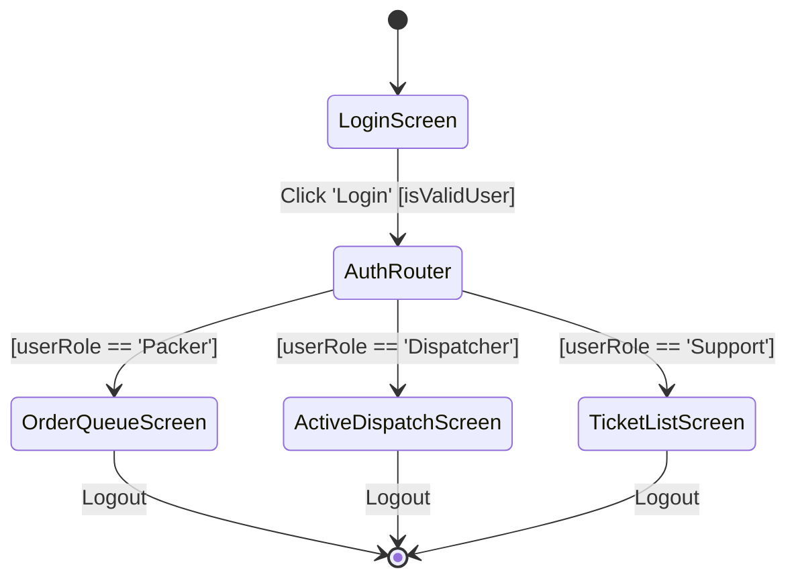

# Overarching Navigation Diagram

This overarching diagram shows the initial authentication routing into the 3 distinct sub-systems representing our highest priority Must-Be Use Cases.

```mermaid
stateDiagram-v2
    [*] --> LoginScreen
    LoginScreen --> AuthRouter : Click 'Login' [isValidUser]
    
    state AuthRouter <<choice>>
    
    AuthRouter --> OrderQueueScreen : [userRole == 'Packer']
    AuthRouter --> ActiveDispatchScreen : [userRole == 'Dispatcher']
    AuthRouter --> TicketListScreen : [userRole == 'Support']
    
    OrderQueueScreen --> [*] : Logout
    ActiveDispatchScreen --> [*] : Logout
    TicketListScreen --> [*] : Logout
```
