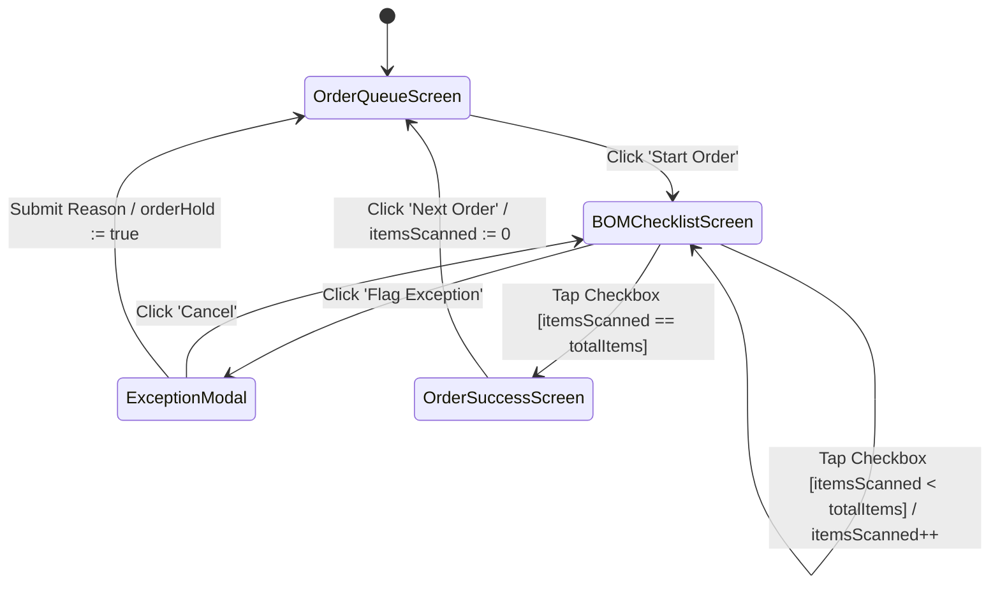

# UC-07: Scan & Verify BOM Navigation Diagram

```mermaid
stateDiagram-v2
    state "OrderQueueScreen" as Queue
    state "BOMChecklistScreen" as Checklist
    state "ExceptionModal" as Exception
    state "OrderSuccessScreen" as Success
    
    [*] --> Queue
    Queue --> Checklist : Click 'Start Order'
    
    Checklist --> Checklist : Tap Checkbox [itemsScanned < totalItems] / itemsScanned++
    Checklist --> Success : Tap Checkbox [itemsScanned == totalItems]
    
    Checklist --> Exception : Click 'Flag Exception'
    Exception --> Checklist : Click 'Cancel'
    Exception --> Queue : Submit Reason / orderHold := true
    
    Success --> Queue : Click 'Next Order' / itemsScanned := 0
```
