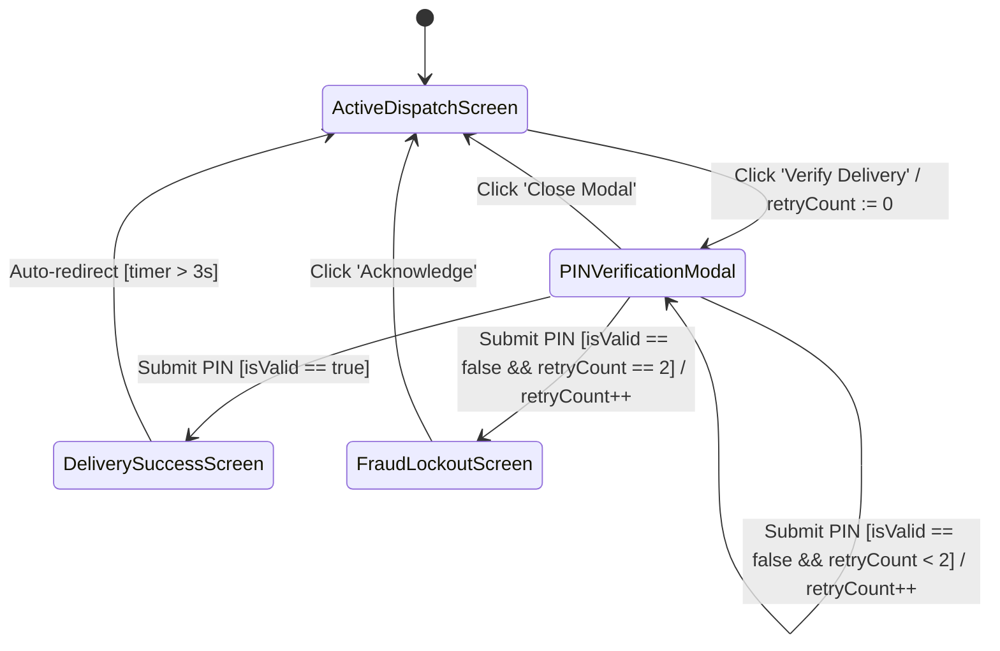

# UC-10: Input Delivery PIN Navigation Diagram

```mermaid
stateDiagram-v2
    state "ActiveDispatchScreen" as Dispatch
    state "PINVerificationModal" as PINModal
    state "DeliverySuccessScreen" as Success
    state "FraudLockoutScreen" as Lockout
    
    [*] --> Dispatch
    Dispatch --> PINModal : Click 'Verify Delivery' / retryCount := 0
    
    PINModal --> PINModal : Submit PIN [isValid == false && retryCount < 2] / retryCount++
    PINModal --> Lockout : Submit PIN [isValid == false && retryCount == 2] / retryCount++
    
    PINModal --> Dispatch : Click 'Close Modal'
    PINModal --> Success : Submit PIN [isValid == true]
    
    Lockout --> Dispatch : Click 'Acknowledge'
    Success --> Dispatch : Auto-redirect [timer > 3s]
```
