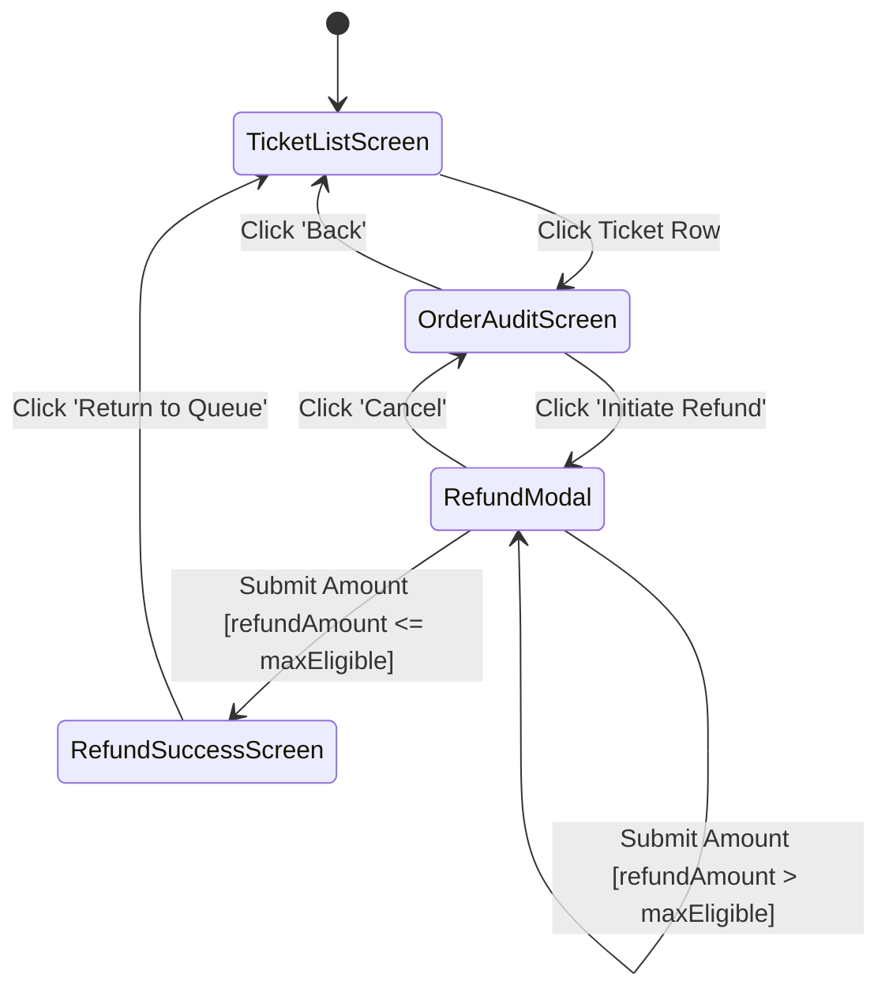

# UC-18: Process Customer Refund Navigation Diagram

```mermaid
stateDiagram-v2
    state "TicketListScreen" as Tickets
    state "OrderAuditScreen" as Audit
    state "RefundModal" as Refund
    state "RefundSuccessScreen" as Success
    
    [*] --> Tickets
    Tickets --> Audit : Click Ticket Row
    Audit --> Tickets : Click 'Back'
    
    Audit --> Refund : Click 'Initiate Refund'
    
    Refund --> Refund : Submit Amount [refundAmount > maxEligible]
    Refund --> Success : Submit Amount [refundAmount <= maxEligible]
    Refund --> Audit : Click 'Cancel'
    
    Success --> Tickets : Click 'Return to Queue'
```
